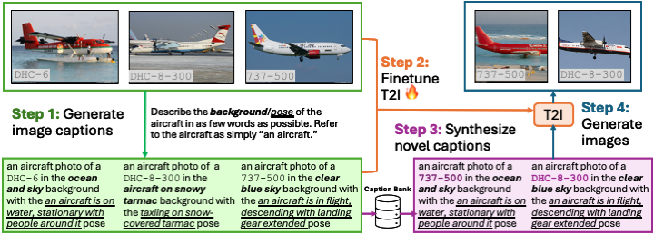

# Beyond Objects: Contextual Synthetic Data Generation for Fine-Grained Classification

**Authors**: William Yang, Xindi Wu, Zhiwei Deng, Esin Tureci, and Olga Russakovsky

Beyond Objects  is a framework for generating contextual synthetic data to improve fine-grained visual classification in low-data regimes. We fine-tune text-to-image (T2I) diffusion models with LoRA on few-shot examples, generate high-quality  synthetic images, and train downstream classifiers on real + synthetic data.



## Installation

To set up:

```bash
conda create -n BeyondObjects python=3.10.12
conda activate BeyondObjects
pip install -r requirements.txt
```


## Quick Start

The full pipeline has three stages: data prep → T2I fine-tuning → synthetic data generation → classifier training.

1) [Prepare datasets](dataset/README.md)

```bash
cd dataset

# Few-shot splits from Diff-II
bash download_fewshot.sh

# Full datasets (Aircraft, Pet, CUB)
python download_real.py

# Stanford Cars (manual): download from Kaggle and place under dataset/real_datasets/car/
# Flowers-102 LT (manual): download and place under dataset/real_datasets/flower/
```

2) [Fine-tune the T2I model with LoRA]((finetune/README.md))

```bash
cd finetune
accelerate config   # disable mixed precision

# Edit finetune.sh to point to your YAML under ../yaml/
bash finetune.sh
```

3) [Generate contextual synthetic images](generation/README.md)

```bash
cd generation
# Edit run.sh to point to your YAML under ../yaml/
bash run.sh [0-49]  # optional array job index

# For multi-GPU parallel generation, see batch_submission.py
```

4) [Train downstream classifier (hyperparameter sweep)](classification/README.md)

```bash
cd classification

# CLIP backbone
bash run_validation.sh clip [lr] [weight_decay] [lambda] [yaml_file]

# ImageNet ResNet-50 backbone
bash run_validation.sh imagenet [lr] [weight_decay] [lambda] [yaml_file]

# MAE backbone
bash run_mae_validation.sh [lr] [weight_decay] [lambda] [yaml_file]

# Automated multi-GPU hyperparameter sweep
python hyperparameter_sweep.py
```


## Evaluation

After selecting best hyperparameters from validation:

```bash
cd classification
python submit_final.py       # CLIP / ResNet
python submit_mae_final.py   # MAE
```

Results and logs are tracked with Weights & Biases (run `wandb login`).


**Acknowledgements**: This work builds on: Hugging Face Diffusers, [DataDream](https://github.com/ExplainableML/DataDream), [Diff-II](https://github.com/HKUST-LongGroup/Diff-II), and Stable Diffusion
